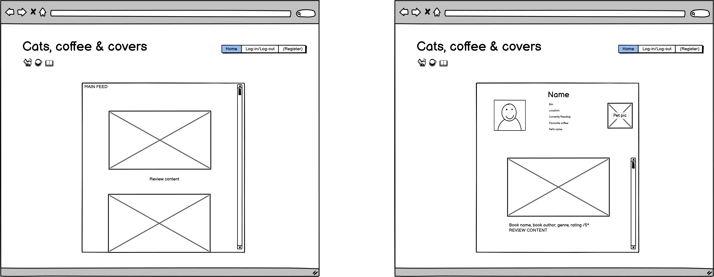
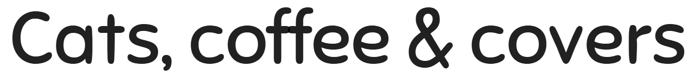

# Cats, Coffee and Covers
This is the README for the Front-end React application - other information can be found in the Back-end repository documentation [here](https://github.com/elamont174/catscoffeecovers).

## Project Overview

### Target Audience

## Agile methodology

## Front-end documentation
### User stories
**Must haves**

- *As a user I can create an account so that I can access feature for logged in users.*
- SUCCESS CRITERIA:
- Users can create an account with a username and password
- Users can access certain content as a logged in user but not a logged out user
- RESULT

- *As a user, I have a customisable profile page where I can display information about myself.*
- SUCCESS CRITERIA:
- Users can read their own and others profile pages
- Users can edit their own profile pages but NOT others
- Some information will be optional and not displayed
- RESULT

- *As a user, I can log-in to the site to access content that can only be accessed by logged-in users.*
- SUCCESS CRITERIA:
- Users can log-in and log-out easily
- RESULT

- *As a user, I can create book reviews to share my views with the community.*
- SUCCESS CRITERIA:
- User can create a review with Book Title, Author, Genre, Content review and an optional photo
- RESULT

- *As a user I can view the review page so that I can read the review.*
- SUCCESS CRITERIA:
- Clicking on the review makes it easier to read
- RESULT

- *As the review owner I can edit my review so that I can make corrections or update my post after it was created*
- SUCCESS:
- The user who created the review can edit the review
- Other users cannot edit the review
- RESULT

- *As the review owner I can delete my review.*
- SUCCESS CRITERIA:
- The user who created the review has the option to delete it
- Other users cannot delete the review
- RESULT

**Should haves**

- *As a user, I can search for a review by book title or genre so that I can find reviews I'm interested in.*
- SUCCESS CRITERIA:
- ability to search for reviews by Book Title, Author, Genre and Reviewer
- RESULT

**Could haves**

- *As a user, I can comment on book reviews so that I can share my views with others.*
- SUCCESS CRITERIA:
- ability to comment on reviews as a user
- RESULT

- *As a user I can 'like' reviews to show that I like them.*
- SUCCESS CRITERIA:
- the ability to like posts
- RESULT

- *As a user I am able to 'follow' my favourite profiles so I can keep up to date with their content.*
- SUCCESS CRITERIA:
- ability to 'follow' another user
- RESULT

- *As a user, I can't upload images which are too big and will disrupt the aesthetic of the page.*
- *As a developer, the user can't upload images which are too big and could cause storage issues.*
- SUCCESS CRITERIA:
- If a user tries to upload a large image, they will receive an error message and the photo won't be uploaded.
- RESULT

### Wireframes 
- 

### User experience
### Design
#### Colour scheme
- 
- The colour scheme was centred around the logo for the site. Once the logo was selected, it was run through imagecolorpicker.com which created the colour-scheme below. 
- 
- The logo was selected as it was soft and cute with gentle pastel colours. Since the theme of the site is around the mindful theme of reading, cats and drinking coffee, these qualities were deemed important. 
- The main colours used for the site are the gentle pink tones in order to provide a calm environment. Any hover features are deliberately blue to create a contrast. 

#### Typography
- Sans-serif is considered the best styles of font for accessibility for dyslexic and autistic people so this was taken into consideration. A font with rounded edges was chosen to fit with the calm, gentle theme of the site. 
- Sniglet was chosen as it fit these criteria:
- 

### Features

#### Profiles

#### Reviews

#### Followers

#### Navigation

### Responsiveness

### Setting up a new repository
1. Do not use the Code Institute template. Create a new blank repository with a unique name (ensure it is lowercase).
2. Create a react app by typing the following into the terminal:
- "npx create-react-app . --template git+https://github.com/Code-Institute-Org/cra-template-moments.git --use-npm"
### Deployment
1. Go to the Dashboard.
2. Click 'New' > 'Create new app'.
3. Choose a **unique** app name, choose the closest region and press 'Create app'.
4. Go to the Heroku app Dashboard.
5. Click the 'Deploy' tab.
6. In the Deployment method section, click "Connect to GitHub".
7. Search for the repo you want to connect and click 'Connect'.
8. Scroll down and click "Deploy Branch" in the Manual deploy section.
9. Your app has been deployed! You can find it in "Open app".

### Security
- A Secret Key was created which was kept secret and kept private in env.py.

### Testing 
Please see separate [TESTING.md](TESTING.md) file for all testing.

## Future improvements
- With more time, I would add comment functionality to the posts. I would also add a search feature.

## Reusable React Components

## Languages
- HTML
- CSS
- BootStrap
- React

## Technologies used
- GitHub
- [Leonardo Ai](https://app.leonardo.ai/) created all of the images - the profile photos and posts.
- [ChatGPT](https://chatgpt.com/) created the book titles, author names and book reviews.
- [Table to Markdown](https://tabletomarkdown.com/convert-spreadsheet-to-markdown/) created the table in my TESTING.md file.
- [ImageColourPicker.com](https://imagecolorpicker.com/) was used to get the colourscheme from the logo. 

## Credits
- I utilised the Code Institute Moments walkthrough to help me create my website and then adapted the code and created 2 unique models to make the project my own. 
- When debugging, [these](https://stackoverflow.com/questions/70612439/csrf-failed-origin-checking-failed-http-localhost8000-does-not-match-any) [sites](https://forum.djangoproject.com/t/django-csrf-trusted-and-allowed-hosts-issues/23842/6) were very helpful. 
- With the help of Slack and [this](https://gist.github.com/ianmeigh/8e603b91a38d7829d959402bfcf29d3d) website I installed ESlint.

## Acknowledgements 
- My mentor Julia Konovalova for always supporting me.
- The Bootcamp team at Code Institute for ensuring I had the space to complete this project while working at the same time. 
- My husband Malcolm Lamont for being my biggest cheerleader and my harshest critic.
- Stephanie Bell for testing my website. 

