# Testing
- Manual testing was carried out throughout the development of the website and bugs fixed as they arose.

## Manual testing 

| Location          | Feature                       | Expected Feature                                                                                            | Pass/Fail | Notes                           |
| ----------------- | ----------------------------- | ----------------------------------------------------------------------------------------------------------- | --------- | ------------------------------- |
| Header            | Add new review                | Opens form to create new review                                                                             | PASS      | Doesn't display when logged out |
| Header            | Home page button              | Takes user to home page on click                                                                            | PASS      |                                 |
| Header            | Feed button                   | Takes user to their feed (posts of people they follow) on click                                             | PASS      | Displays when logged in         |
| Header            | Liked button                  | Takes user to their liked posts on click                                                                    | PASS      | Displays when logged in         |
| Header            | Log-out button                | Logs user out on click                                                                                      | PASS      | Displays when logged in         |
| Header            | Profile button                | Takes user to their profile on click                                                                        | PASS      | Displays when logged in         |
| Header            | Logo                          | Take user to home page on click                                                                             | PASS      |                                 |
| Header            | Log-in button                 | Take user to log-in page on click                                                                           | PASS      | Displays when logged out        |
| Header            | Register button               | Take user to registration page on click                                                                     | PASS      | Displays when logged out        |
| Log-in page       | Log-in form                   | When correct username and password entered, click log-in and user is logged in                              | PASS      |                                 |
| Log-in page       | Log-in form                   | When incorrect username and password entered, error message is displayed                                    | PASS      |                                 |
| Log-in page       | Register button               | Take user to registration page on click                                                                     | PASS      |                                 |
| Registration page | Registration form             | When correct username and matching passwords entered, click log-in and user is logged in                    | PASS      |                                 |
| Registration page | Registration form             | When non-unique username and/or non-matching passwords entered, error message is displayed                  | PASS      |                                 |
| Registration page | Login button                  | Take user to login page on click                                                                            | PASS      |                                 |
| Home page         | Posts                         | Opens up post on click (for clearer viewing and/or editing)                                                 | PASS      |                                 |
| Home page         | Like button on posts          | User can like or unlike on click                                                                            | PASS      |                                 |
| Feed page         | Reviews displayed             | Reviews displayed are by profiles that I follow                                                             | PASS      |                                 |
| Feed page         | Posts                         | Opens up post on click (for clearer viewing and/or editing)                                                 | PASS      |                                 |
| Feed page         | Like button on posts          | User can like or unlike on click                                                                            | PASS      |                                 |
| Liked page        | Reviews displayed             | Reviews displayed are reviews that I have liked                                                             | PASS      |                                 |
| Liked page        | Posts                         | Opens up post on click (for clearer viewing and/or editing)                                                 | PASS      |                                 |
| Liked page        | Like button on posts          | User can like or unlike on click                                                                            | PASS      |                                 |
| Profile page      | Username displayed            | Username that user signed up with is displayed at the top                                                   | PASS      |                                 |
| Profile page      | Number of reviews             | Number of reviews increases when I create a new review                                                      | PASS      |                                 |
| Profile page      | Number of follwers            | Number of followers increases when I follow someone                                                         | PASS      |                                 |
| Profile page      | Number of following           | Number of 'following' increases when someone follows me                                                     | PASS      |                                 |
| Profile page      | Information paragraph         | Information paragraph is made up of information submited by the user                                        | PASS      |                                 |
| Profile page      | "Username's reviews"          | Displays the username with "'s reviews" on the end                                                          | PASS      |                                 |
| Profile page      | Edit button                   | When clicked, gives option to "edit profile", "change username", "change password"                          | PASS      |                                 |
| Profile page      | Edit button > Edit profile    | When clicked, opens form where user can change info in information paragraph and change their profile photo | PASS      |                                 |
| Profile page      | Edit button > Change username | When clicked, opens forms where user can change their username                                              | PASS      |                                 |
| Profile page      | Edit button > Change password | When clicked, opens forms where user can change their password                                              | PASS      |                                 |
| Profile page      | Profile picture               | Displays profile picture uploaded by user in "Edit profile" or a default image                              | PASS      |                                 |
| Profile page      | Posts                         | Opens up post on click (for clearer viewing and/or editing)                                                 | PASS      |                                 |
| Profile page      | Like button on posts          | User can like or unlike on click                                                                            | PASS      |                                 |

## Validators
### HTML
- [W3C validator](https://validator.w3.org/) was used to validate the page source code of the site.
- The validation came back clear.
- 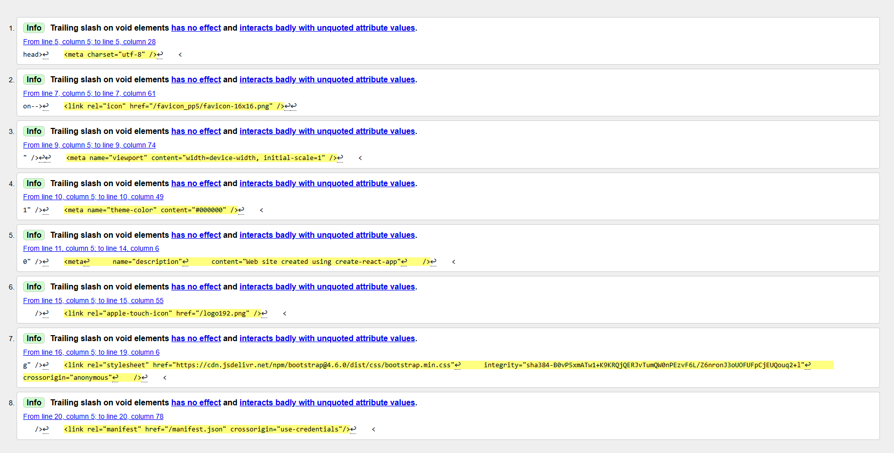

### CSS
- [W3 Jigsaw validator](https://validator.w3.org/) was used to validate all CSS files.
- The validation came back clear for every one.
- 

### JavaScript
- ESLint was installed in the terminal and adapted to test the JavaScript.
- 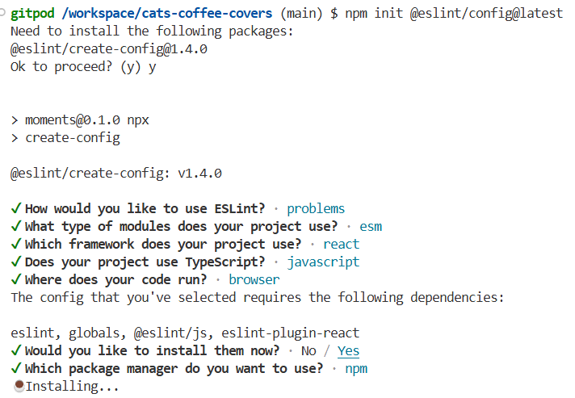
- 

### Lighthouse
- 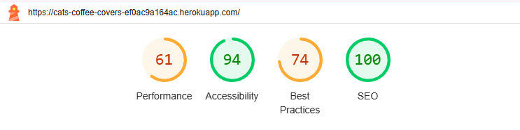
- 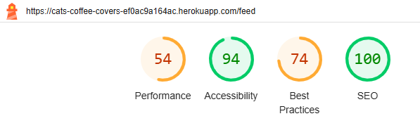
- 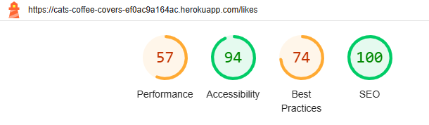
- 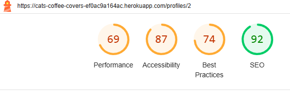

- Performance could be improved by using smaller images. There is an image filter applied to stop very large images, in future this could be decreased more. 
- The profile page was marked down for accessibility for lack of 'alt' attributes. This would be a future feature that would be included. 

## Responsiveness
- Responsiveness was tested with the Google Extension - [Responsive tester](https://chromewebstore.google.com/detail/responsive-tester/ppbjpbekhmnekpphljbmeafemfiolbki).
- 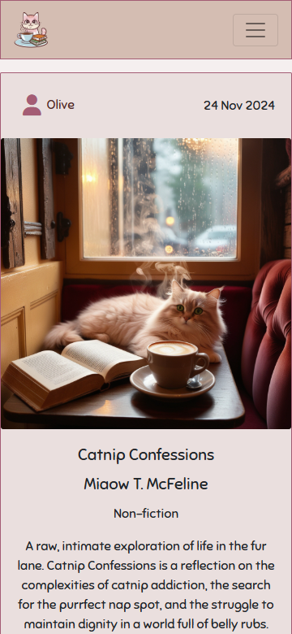
- 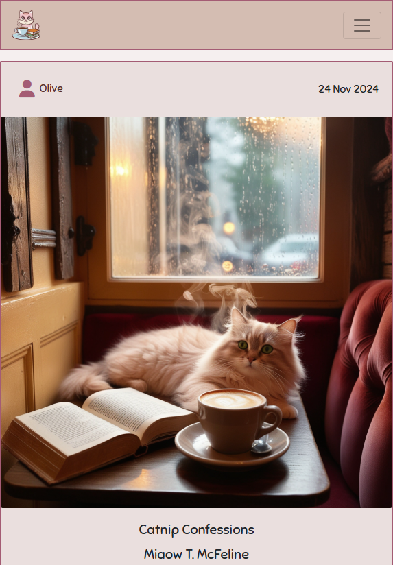
- 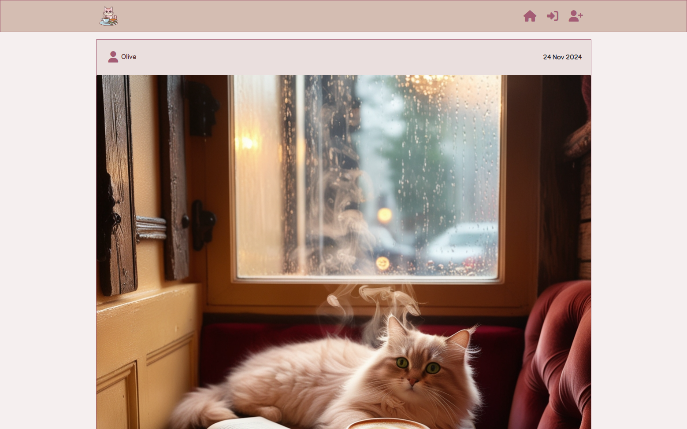

- Website was successfully tested on Edge, Opera and Chrome.
- 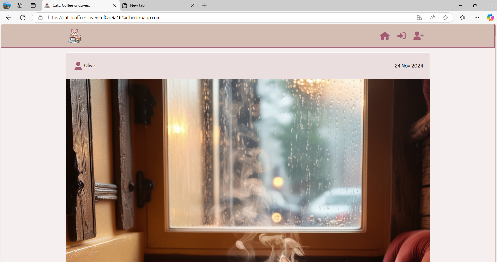
- 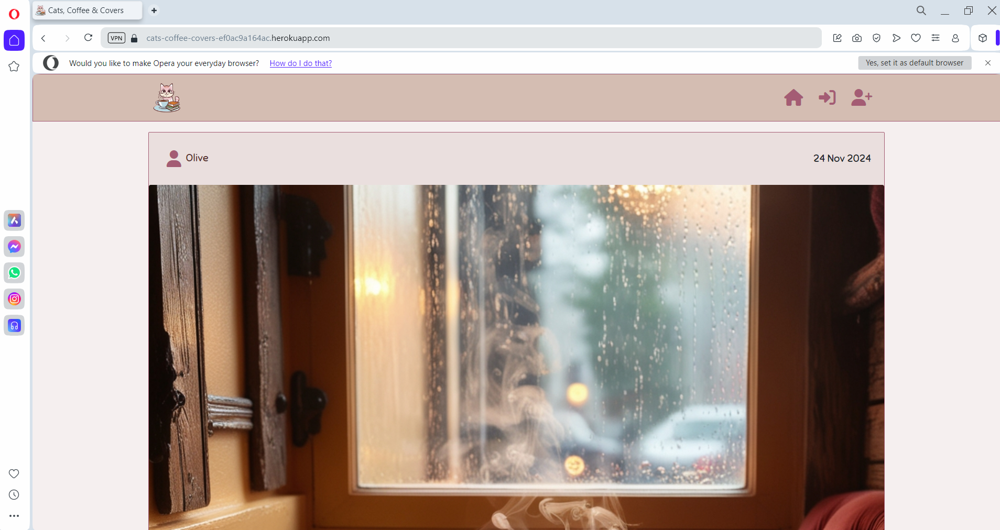
- 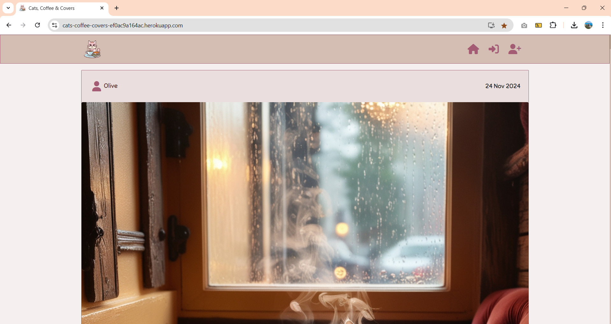

## Bugs
Bug 1. When setting up the repository, the preview wasn't working:
- 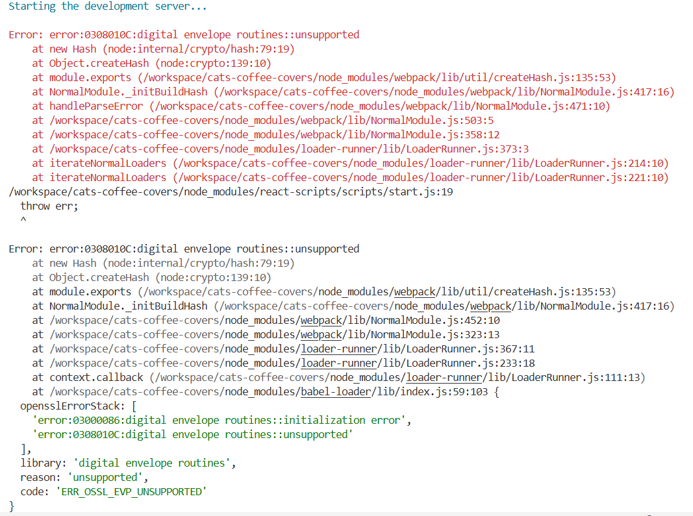 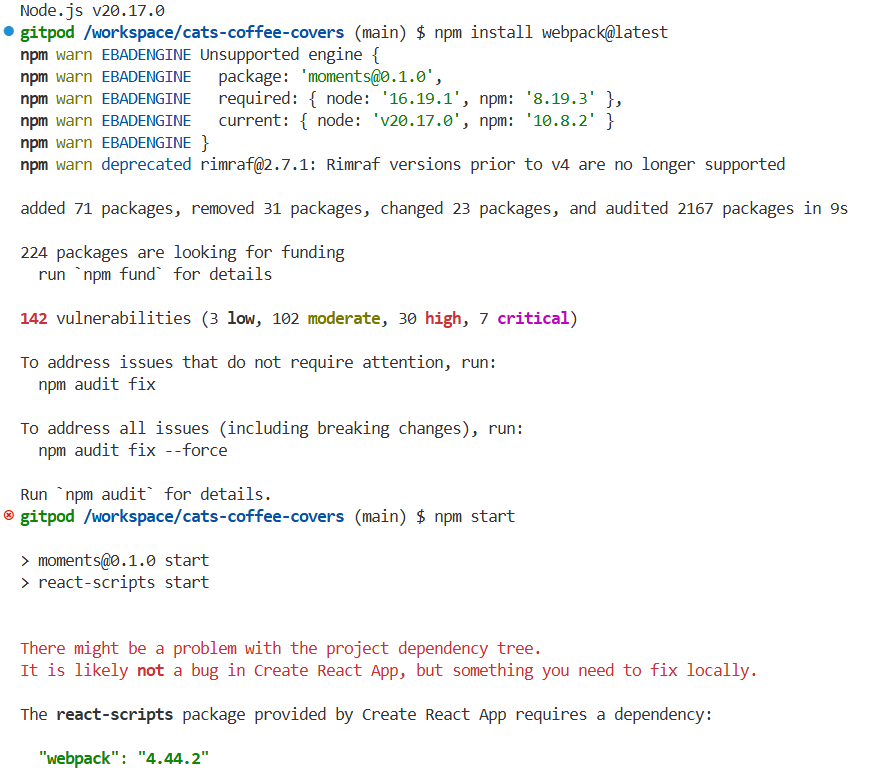 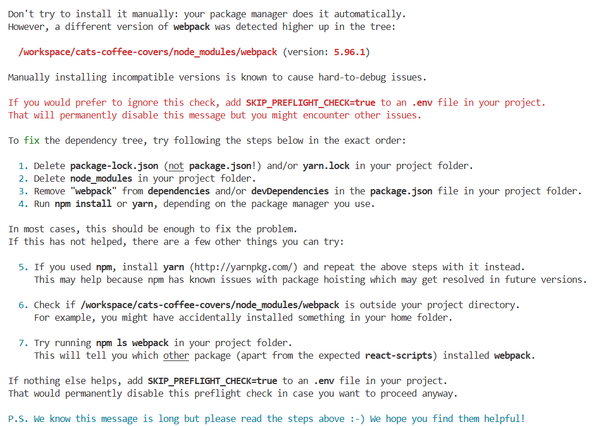
- I carried out the following steps:
1. npm install webpack@latest
2. npm audit fix
3. Delete package-lock.json
4. Delete node_modules in project folder
5. Remove "webpack" from dependencies in the package.json file in project folder
6. Deleted workspace and started again
7. nvm install 16, nvm use 16
8. Worked with version 16

Bug 2. When trying to create a new post, the following error arose.
- 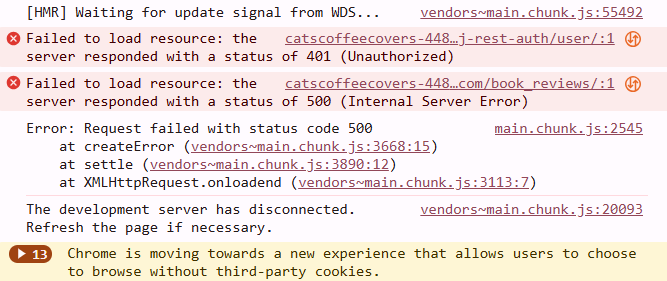 
- I found that there was an error in the serializers.py file and that my JS tokens weren't synced up properly.

Current Bug.
- An image filter is set up where, if too large a photo is uploaded, an error message shows and the image is not allowed to be uploaded.
- Currently, the photo will not be uploaded, but the error message doesn't show. This would be a future improvement. 
